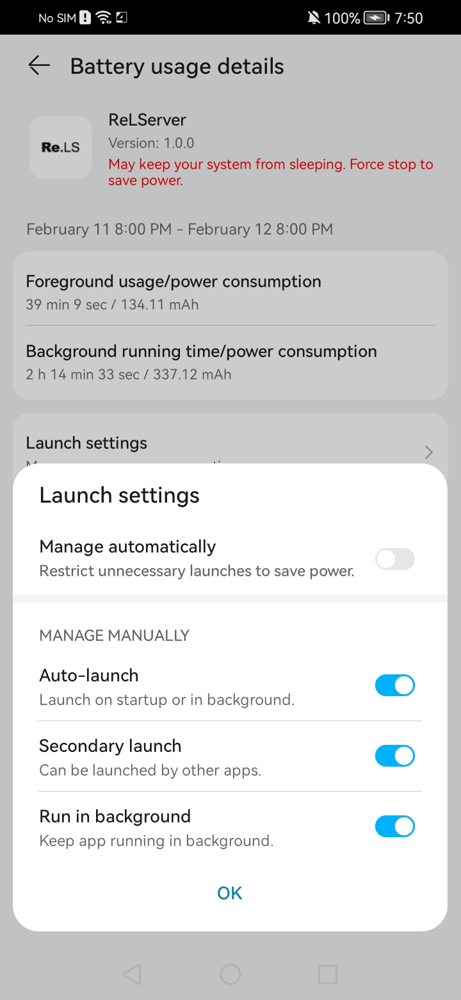
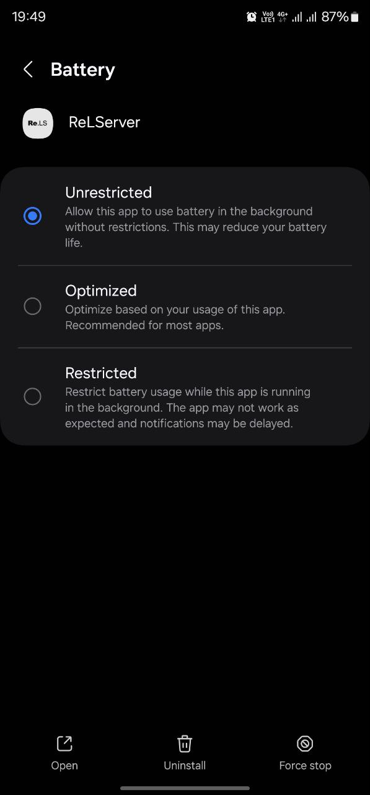
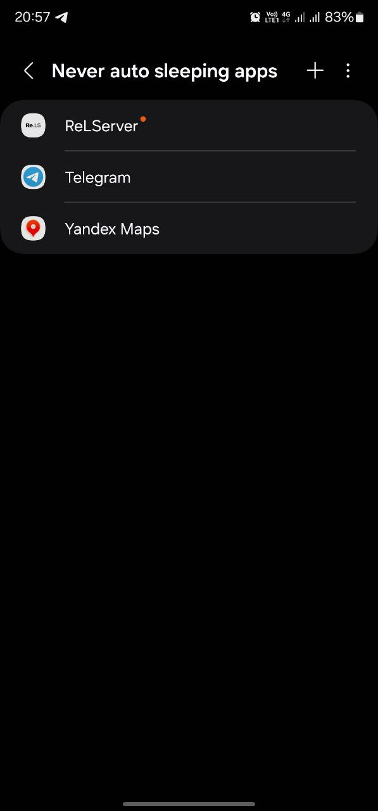
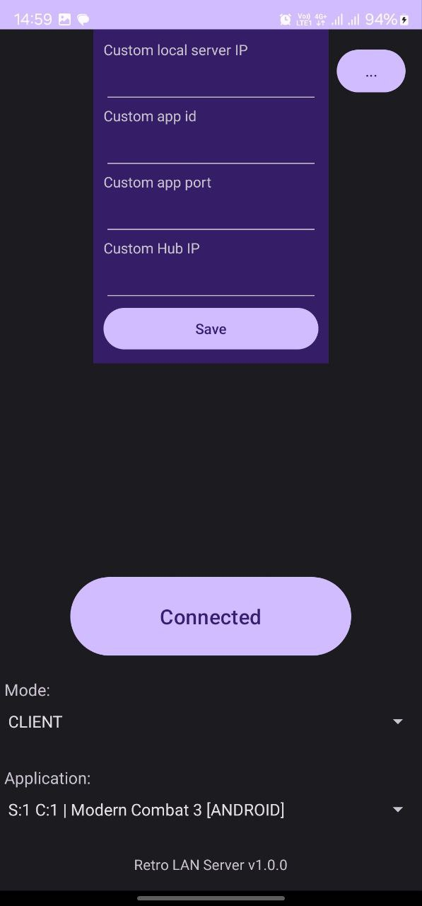
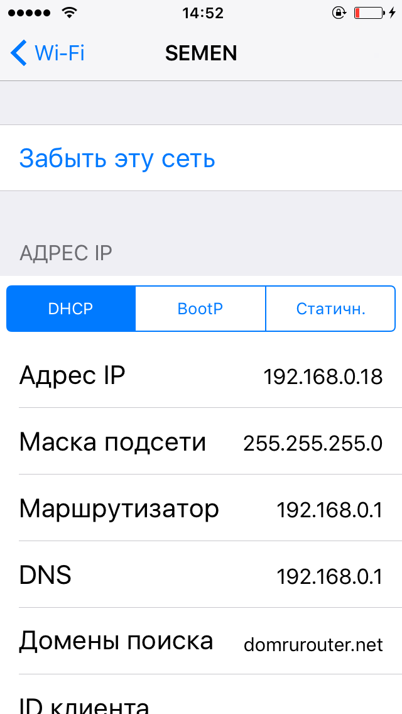
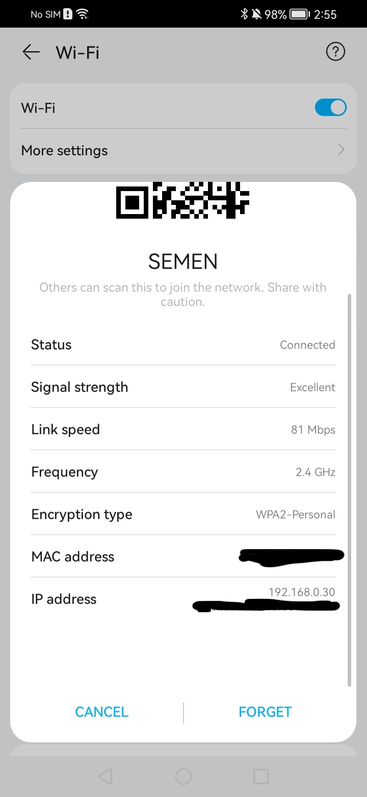
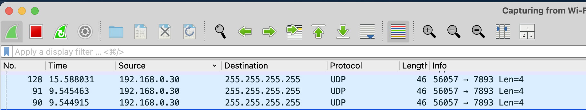

# Retro LAN Server

<p align="center">
  
<p>
Share your local game server over the internet and connect with others.

[4PDA](https://4pda.to/forum/index.php?showtopic=1101727)

## Concept

ReLServer can be run in two modes:

- **CLIENT** - when you want to connect to other people's servers. ReLServer creates a "phantom" server on your LAN that
  will listen for requests from your application and proxy to the real server over the internet.
- **SERVER** - when you want to share your server. ReLServer will manage p2p connections with the corresponding clients
  and proxy them to the real server.
- **HUB** - public peer-to-peer connection exchange server. Receives the public IP address of a peer connection and
  notifies clients and servers of new connections. (STUN server concept)

ReLServer can be run on another device that connected to the local network when running on the target device is not
possible.
ReLServer in SERVER mode by default proxies connections to localhost:appPort. You can specify a device with a running
server in the local network for proxy connections to its port.

## How to run

### Windows/Mac/Linux
Download a jar file from the [Releases tab](https://github.com/alekseypokhilko/ReLServer/releases) and run in terminal:
```bash
java -jar relserver.jar -mode=client -appId=appIdFromCatalog
#or
#-localServerIp=192.168.0.123 - address of the real server in the local network
java -jar relserver.jar -mode=server -appId=appIdFromCatalog
#or
java -jar relserver.jar -mode=hub
```

### Android

Download APK from the [Releases tab](https://github.com/alekseypokhilko/ReLServer/releases).

0. After installing ReLServer disable battery optimization for ReLServer in the settings, otherwise the connection will
   be interrupted.

<p align="center">



<p>

**ReLServer will be launched on the same device in client mode**
- Turn on WiFI (You don't have to connect to networks and be on mobile internet)
- In the ReLServer app, select CLIENT mode, a game from the list and press the connect button.
- Done. You can enter the game and update the list of servers.
- At the end of the game session, press the disconnect button in ReLServer.
<p align="center">

<p>

**ReLServer will be launched on another device in the local network in client mode**
- The device on which ReLServer will be launched and the device on which the game will be launched must be connected to the same WiFi point.
- Launch ReLServer in the same way as in point 1.
<p align="center">


<p>

**ReLServer will be launched on the same device in server mode**
- In the ReLServer app, select SERVER mode, a game from the list and press the connect button.
- Done. You can enter the game and create a match. Or you can create a match and then launch ReLServer.
- At the end of the game session, press the disconnect button in ReLServer.
<p align="center">

<p>

**ReLServer will be launched on another device in the local network in server mode**
- The device on which ReLServer will be launched and the device on which the game will be launched must be connected to the same WiFi point.
- In the ReLServer application, select the SERVER mode, the game from the list
- In the additional settings, specify the local IP of the device on which the match will be launched. The IP can be taken from the WiFi connection parameters (starts with 192.168….)
- Press the connect button.
- Done. You can enter the game and create a match. Or you can create a match, and then launch ReLServer.
- At the end of the game session, press the disconnect button in ReLServer.
<p align="center">


<p>
<p align="center">


<p>

**ReLServer will be launched using Termux**

Download a jar file from the [Releases tab](https://github.com/alekseypokhilko/ReLServer/releases). Install [Termux](https://github.com/termux/termux-app) (or another terminal app). Install Java. Open terminal and
run ReLServer.

```bash
#Install Java
pkg install openjdk-17

java -jar relserver.jar -mode=server -appId=appIdFromCatalog
#or
java -jar relserver.jar -mode=client -appId=appIdFromCatalog
```

### Another devices

If the terminal application and Java are not supported on the device, you can run ReLServer on a supported device and
connect both of them to the local network.

## FAQ

**How to create a private server?**

- You need to generate a unique -appId value (For example: private24532)
- All participants must specify it when starting ReLServer in the -appId parameter
  along with the application port. (For example: -appId=private24532 -appPort=7893)

**How to play a game that is not on the list?**
- To do this, you need to download Wireshark and start scanning the local network
- Find out the IP address of the device on which the game will be launched
- Search for LAN servers in the game
- In Wireshark, see to what address and port the UDP packet was sent from the device IP (For example: 255.255.255.255:7893)
- Launch ReLServer on several devices, specify the port and game ID in the launch parameters (For example: -appPort=7893 -appId=glmc3fn)
- Check the connection and the ability to play over the Internet
- If it works, add the game to the list of supported ones. Make PR to src/main/resources/applications.json
<p align="center"><p>